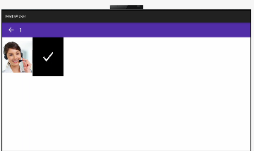

# Multiple Media Picker:

[](https://github.com/applibgroup/UnifiedContactPicker/actions/workflows/main.yml)
[](https://sonarcloud.io/dashboard?id=applibgroup_UnifiedContactPicker2)

## Introduction

An android library to pick multiple images and/or videos from built-in gallery. This library is encouraged to use as little memory as possible. 

# Source

The code in this repository was inspired from  https://github.com/erikagtierrez/multiple-media-picker.git. We are very thankful to erikagtierrez.

## Demo


&nbsp;&nbsp;&nbsp;&nbsp;&nbsp;&nbsp;&nbsp;&nbsp;&nbsp;&nbsp;&nbsp;&nbsp;&nbsp;&nbsp;&nbsp;&nbsp;


## Features

* Multiple images
* Multiple videos
* Easy and redy to use
* Display list of images and/or videos

## Installation

In order to use the library, add the following line to your **root** gradle file:

1. For using Multiplemediapicker module in sample app, include the source code and add the below dependencies in entry/build.gradle to generate hap/support.har.
```
	dependencies {
           implementation project(':multiplemediapicker')
            testCompile 'junit:junit:4.12'
	}
```

2 .  For using Multiplemediapicker in separate application using har file, add the har file in the entry/libs folder and add the dependencies in entry/build.gradle file.
  ```
  	dependencies {
              implementation fileTree(dir: 'libs', include: ['*.har'])
              testCompile 'junit:junit:4.12'
  	}
  
  ```


# Usage

To use Multiplemediapicker in your app simply follow this 3 simple steps:

1. Add _WRITE_MEDIA_,READ_USER_STORAGE,_WRITE_USER_STORAGE_ permission in your config

```
 "abilities": [

    "reqPermissions": [
      {
        "name": "ohos.permission.WRITE_MEDIA"
      },
      {
        "name": "ohos.permission.WRITE_USER_STORAGE"
      },
      {
        "name": "ohos.permission.READ_USER_STORAGE"
      },
      {
        "name": "ohos.permission.READ_MEDIA"
      }
    ]
```
2 . Launch _SelectImages.java_ as activity result

```
    java
    Your Activity or Fragment
    button.setClickedListener(listener ->
               present(new HomeAbilitySlice(), new Intent());
    }
```

3 . OpenGalleryAbilitySlice()_   select the images.

```
    java
    public void populateListContainer() {
        HiLog.info(LABEL, " bitmapList.size() :"   + bitmapList.size());
        for (int i = 0; i < selected.size(); i++) {
            boolean result = imagesSelected.contains(bitmapList.get(i)) ? true : false;
            selected.set(i,result);
        }
          
            HomeAbilitySlice.selectionTitle = imagesSelected.size();
            if (imagesSelected.size() != 0) {
                appBarTitle.setText(String.valueOf(imagesSelected.size()));
                HiLog.info(LABEL, " String.valueOf(imagesSelected.size()) :" + imagesSelected.size());
            } else {
                appBarTitle.setText(HomeAbilitySlice.title);
            }
        });

    }
```

Images are selected in a ArrayList of *OneFraction ; object have the following accessible properties:
 * ImageName - Image display name
 * Image - Image selected 

## Support & extension

Currently there is a limitation to access the Image internal part , temporary the static list has been used to select the image.
In future below modification is expected for selecting the images from whatsapp ,screenshot instead of internal list.

Modifications required in ContactPickerAbility.java. 

1.In onstart() method call slecting images.

2.In getPicBuckets() method will give the  list of slected images 

3.Display the list of images and count

- Feel free to make any pull request to add a new behaviour or fix some existing bug
- Feel free to open issues if you find some bug or unexpected behaviour
- I'll keep polishing and giving support to this library in my free time


# License

```

 Copyright (C) 2020-21 Application Library Engineering Group

 Licensed under the Apache License, Version 2.0 (the "License");
 you may not use this file except in compliance with the License.
 You may obtain a copy of the License at

      http://www.apache.org/licenses/LICENSE-2.0

 Unless required by applicable law or agreed to in writing, software
 distributed under the License is distributed on an "AS IS" BASIS,
 WITHOUT WARRANTIES OR CONDITIONS OF ANY KIND, either express or implied.
 See the License for the specific language governing permissions and
 limitations under the License.
 
```
